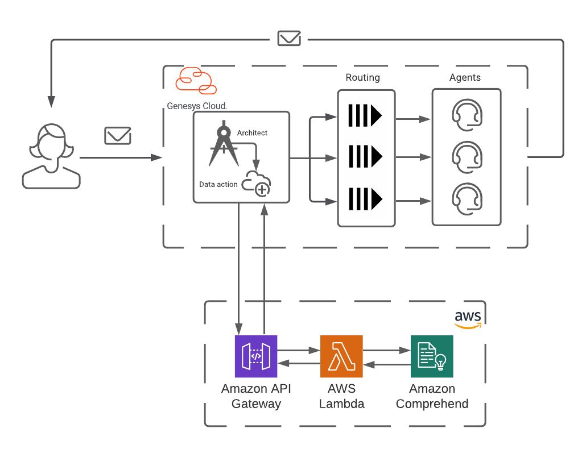

# Genesys Cloud Email Routing and Classification using AWS Comprehend

> View the full [Genesys Cloud Email Routing and Classification using AWS Comprehend](https://developer.mypurecloud.com/blueprints/) article on the Genesys Cloud Developer Center.

This Genesys Cloud Developer Blueprint provides instructions for building a Genesys Cloud email flow that leverages an AWS Comprehend machine learning classifier to classify an email and map the email to a routing queue specific to that email classification. 

In this blueprint we will demonstrate how to train a AWS Machine Learning classifier, leverage AWS Api Gateway and Lambda to build a microservice to provide email classification, and leverage `CX as Code` to deploy all of the Genesys Cloud objects needed to build and support this email flow.

