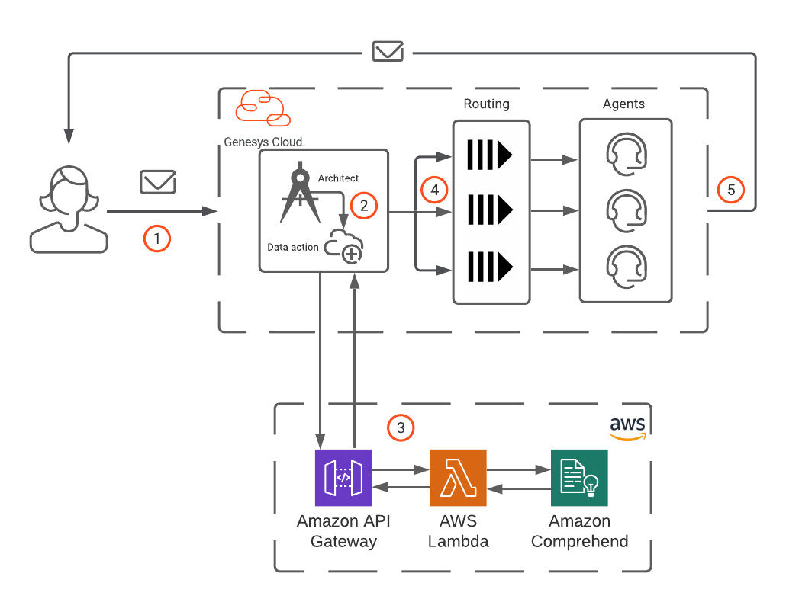

This Genesys Cloud Developer Blueprint explains how to use Amazon Comprehend's Natural Language Processing (NLP) to classify inbound emails so they can be routed to a specific queue.

This blueprint also demonstrates how to:
* Use machine learning to train the Amazon Comprehend classifier
* Use AWS Lambda to build a microservice, which invokes the Amazon Comprehend classifier
* Use the Amazon API Gateway to expose a the Amazon Comprehend REST endpoint
* Use the CX as Code configuration tool to deploy all of the required Genesys Cloud objects including the Architect inbound email flow

## Scenario
A large financial services business has product offerings for 401Ks, IRAs, and 529 college savings accounts. It has three distinct contact center groups with agents who specialize in each of these financial service products. The business wants to improve how inbound emails are sorted and routed to agents in order to improve customer service.

## Solution
Amazon Comprehend uses Natural Language Processing to analyze the contents of inbound emails and assign each email a classification. An Architect inbound email flow uses the classification to route each email to the appropriate queue. If an email cannot be classified, then Architect routes it to a general support queue.

The following illustration highlights these steps in the workflow:

1. A customer sends an email to your call center.
2. The Architect inbound email flow uses a Genesys Cloud data action to invoke a REST-based service that sends the email body and subject to the REST service for classification. ***QUESTION: Is this a data action or a data action integration***?
3. The Amazon API Gateway, an AWS service, exposes the REST service. The gateway forwards the request to an AWS Lambda to process the classification request. Lambda invokes the Amazon Comprehend classifier endpoint to classify the contents of the email body in real time. If the Lambda is able to classify the email at a 75 percent confidence or better level, it returns one of these three categories back to the email flow: 401K, IRA, or 529. If the classifier cannot reach this level of confidence, then it returns an empty string
4. The Architect flow receives the classification, looks up the corresponding queue name, and then routes the email to the targeted queue. If the flow receives an empty string, it routes the email to a general support queue.
5. After an agent receives the email, they respond to the customer directly from Genesys Cloud.



## Contents

* [Solution components](#solution-components "Goes to the Solution components section")
* [Prerequisites](#prerequisites "Goes to the Prerequisites section")
* [Implementation steps](#implementation-steps "Goes to the Implementation steps section")
* [Additional resources](#additional-resources "Goes to the Additional resources section")

## Solution components

* **Genesys Cloud** - A suite of Genesys cloud services for enterprise-grade communications, collaboration, and contact center management. In this solution, you use an Architect inbound email flow, integration, data actions, queues, and email configuration in Genesys Cloud. ***QUESTION: Please confirm: integration, data actions (plural; or is this a data action integration?), and email configuration***
* **Amazon API Gateway** - An AWS service for using APIs in a secure and scalable environment. In this solution, the API Gateway exposes a REST endpoint that is protected by an API key. Requests that comes to the gateway are forwarded to an AWS Lambda.
* **AWS Lambda** - A serverless computing service for running code without creating or maintaining the underlying infrastructure. In this solution, AWS Lambda processes requests that come through the Amazon API Gateway and calls the Amazon Comprehend endpoint.  
* **Amazon Comprehend** - An AWS service that uses natural-language processing (NLP) to analyze and interpret the content of text documents. In this solution, you use Amazon Comprehend to train a machine learning model that does real-time classification of inbound emails so they can be routed to the appropriate queue.

:::primary
**Important**: AWS CloudFormation does not support the Amazon Comprehend API.
:::

## Prerequisites

### Specialized knowledge

* Administrator-level knowledge of Genesys Cloud
* AWS Cloud Practitioner-level knowledge of AWS IAM, Amazon Comprehend, Amazon API Gateway, AWS Lambda, AWS SDK for JavaScript, and the AWS CLI (Command Line Interface)
* Experience using the Genesys Cloud Platform API and Genesys Cloud Python SDK

### Genesys Cloud account

* A Genesys Cloud license. For more information, see [Genesys Cloud Pricing](https://www.genesys.com/pricing "Opens the Genesys Cloud pricing page") in the Genesys website.
* Master Admin role. For more information, see [Roles and permissions overview](https://help.mypurecloud.com/?p=24360 "Opens the Roles and permissions overview article") in the Genesys Cloud Resource Center.
* Archy. For more information, see [Welcome to Archy](/devapps/archy/ "Goes to the Welcome to Archy page") in the Genesys Cloud Developer Center.
* Genesys Cloud Platform API Client SDK - Python. For more information, see [Platform API Client SDK - Python](/api/rest/client-libraries/python/ "Goes to the Platform API Client SDK - Python page") in the Genesys Cloud Developer Center.

### AWS account

* An administrator account with permissions to access the following services:
  * AWS Identity and Access Management (IAM)
  * AWS Comprehend
  * AWS API Gateway
  * AWS Lambda
* AWS credentials. For more information about setting up your AWS credentials on your local machine, see [About credential providers](https://docs.aws.amazon.com/sdkref/latest/guide/creds-config-files.html "Opens the About credential providers page") in AWS documentation.
* AWS CLI. For more information about installing the AWS CLI on your local machine, see [About credential providers](https://aws.amazon.com/cli/ "Opens the About credential providers page") in the AWS documentation.

### Development tools running in your local environment
* Serverless Framework running on the machine where you will deploy the solution. For more information see [Get started with Serverless Framework](https://www.serverless.com/framework/docs/getting-started/ "Opens the Serverless Framework page") in the Serverless Framework documentation.
* Terraform (the latest binary). For more information, see [Download Terraform](https://www.terraform.io/downloads.html "Opens the Download Terraform page") in the Terraform website.
* NodeJS version 14.15.0. For more information, see [Install NodeJS](https://github.com/nvm-sh/nvm "Opens the NodeJS GitHub repository").  
* Python 3.7 or later. For more information, see [Python downloads](https://www.python.org/downloads/ "Goes to the Python Downloads website").

## Implementation steps

1. [Clone the GitHub repository](#clone-the-github-repository "Goes to the Clone the GitHub repository section")
2. [Train and deploy the AWS Comprehend machine learning classifier](#train-and-deploy-the-aws-comprehend-machine-learning-classifier "Goes to the Train and deploy the AWS Comprehend machine learning classifier section")
3. [Deploy Amazon API Gateway and AWS Lambda](#deploy-amazon-api-gateway-and-aws-lambda "Goes to the Deploy Amazon API Gateway and AWS Lambda section")
4. [Deploy the Genesys Cloud objects](#deploy-the-genesys-cloud-objects "Goes to the Deploy the Genesys Cloud objects section")

### Clone the GitHub repository

Clone the GitHub repository [email-aws-comprehend-blueprint](https://github.com/GenesysCloudBlueprints/email-aws-comprehend-blueprint "Opens the GitHub repository") to your local machine. The `email-aws-comprehend-blueprint/components` folder includes solution-specific scripts and files in these subfolders:
  - `components/aws-comprehend`
  - `components/aws-classifier-lambda`
  - `components/genesys-email-flow`

### Train and deploy the Amazon Comprehend machine learning classifier

To classify the inbound email messages, you must first train and deploy an Amazon Comprehend machine learning classifier. To do this, you can either use the AWS Management Console or the AWS CLI. This blueprint uses the AWS CLI.

:::primary
**Note**: In this blueprint, all the AWS CLI commands are run from the `components/aws-comprehend` directory.
:::

1. Set up your Amazon S3 bucket:

   ```
   aws s3api create-bucket --acl private --bucket <<your-bucket-name-here>> --region <<your region>>
   ```
2. Copy and paste the `components/aws-comprehend/comprehendterm.csv` training corpus file into it:

   ```
   aws s3 cp comprehendterms.csv s3://<<your-bucket-name-here>>
   ```

3. In the `components/EmailClassifierBucketBucketAccessRole-Permission.json` file, modify line 10 and line 19 with the location of your S3 bucket.

4. Create the AWS Identity and Access Management (IAM) role and policy and attach the role to the policy that the AWS Comprehend classifier uses:

   ```
   aws iam create-role --role-name EmailClassifierBucketAccessRole --assume-role-policy-document file://EmailClassifierBucketAccessRole-TrustPolicy.json
   ```

   ```
   aws iam create-policy --policy-name BucketAccessPolicy --policy-document file://EmailClassifierBucketAccessRole-Permissions.json
   ```

   ```
   aws iam attach-role-policy --policy-arn <<POLICY ARN return from the aws iam create-policy command above>> --role-name EmailClassifierBucketAccessRole
   ```

   Make a note of the `policy-arn` value returned when you run the command `aws iam create-policy`. You need to use this value in the next step.

5. Train the Amazon Comprehend document classifier:

  ```
  aws comprehend create-document-classifier --document-classifier-name FinancialServices --data-access-role-arn <<ARN FROM STEP 2 HERE>> --input-data-config S3Uri=s3://<<YOUR BUCKET NAME HERE>> --language-code en
  ```
  It takes several minutes for Amazon Comprehend to train the classifier, and you can proceed to the next step only after the training is completed. To check the status of the classifier, use the command:

   ```
   aws comprehend list-document-classifiers
   ```

  When the `Status` attribute returns `TRAINED`, your classifier training is complete. Make a note of the `DocumentClassifierArn` value to use in the next step.

6. Create the real-time document classifier endpoint:

  ```
  aws comprehend create-endpoint --endpoint-name emailclassifier --model-arn <<YOUR DocumentClassifierArn here>> --desired-inference-units 1
  ```

  It takes several minutes for the real-time classifier endpoint to activate. To monitor the status of the endpoint, use the command:

  ```
  aws comprehend list-endpoints
  ```
  Check for the endpoint named `emailclassifier`. When the `Status` attribute is set to `IN_SERVICE`, the classifier is ready for use. Make a note of the `EndpointArn` attribute for the `emailclassifier` endpoint that you have created. This value will need to be set when you are deploying the classifier Lambda later on in the blueprint.

7. Test the classifier:

  ```
  aws comprehend classify-document --text "Hey I had some questions about what I can use my 529 for in regards to my children's college tuition. Can I spend the money on things other then tuition" --endpoint-arn <<YOUR EndpointArn>>
  ```

  If the deployment is successful, a JSON output similar to the following appears:

  ``` language:JSON
  {
    "Classes": [
        {
          "Name": "529",
          "Score": 0.7981914281845093
        },
        {
          "Name": "401K",
          "Score": 0.14315158128738403
        },
        {
          "Name": "IRA",
          "Score": 0.0586569607257843
        }
      ]
    }
  ```

### Deploy the serverless microservice using AWS Lambda and Amazon API Gateway

Deploy the microservice that passes the email body from the Genesys Cloud Architect email flow to the Amazon Comprehend classifier. To do this, invoke the AWS Lambda function using the Amazon API Gateway endpoint. The AWS Lambda is built using Typescript and deployed using the [Serverless](https://www.serverless.com/) framework.

1. Create a `.env.dev` file in the `components/aws-classifier-lambda` directory. Add the two parameters, `CLASSIFIER_ARN` and `CLASSIFIER_CONFIDENCE_THRESHOLD` in the file.
  * Set the `CLASSIFIER_ARN` to the `EndpointArn` value noted in the procedure [Train and deploy the AWS Comprehend machine learning classifier](#train-and-deploy-the-aws-comprehend-machine-learning-classifier "Goes to the Train and deploy the AWS Comprehend machine learning classifier section").
  * Set the `CLASSIFIER_CONFIDENCE_THRESHOLD` parameter value between 0 and 1 to signify the level of confidence that you want the classifier to reach before a classification is returned. For example, if `CLASSIFIER_CONFIDENCE_THRESHOLD` is set to 0.75, then the classifier must reach a confidence level of at least 75 percent. If the classifier cannot reach this threshold, then an empty string is returned.

  Example `.env.dev` file:

  ```
  CLASSIFIER_ARN=arn:aws:comprehend:us-east-1:000000000000:document-classifier-endpoint/emailclassifier-example-only     CLASSIFIER_CONFIDENCE_THRESHOLD=.75
  ```
  :::primary
  **Tip**: You can also retrieve the `EndpointArn` endpoint value using the command `aws comprehend list-endpoints`.
  :::

2. Open a command prompt and change to the directory `/components/aws-classifier-lambda`.
3. Download and install all the third-party packages and dependencies:

  ```
  npm i
  ```

4. Deploy the Lambda function:

   ```
   serverless deploy
   ```

    The deployment takes approximately a minute to complete. Make a note of the `api key` and `endpoints` attributes. You will need them when you deploy the Genesys Cloud inbound flow.

5. Test the Lambda function:

  ```shell
  curl --location --request POST '<<YOUR API GATEWAY HERE>>' \
  --header 'Accept: application/json' \
  --header 'Content-Type: application/json' \
  --header 'x-amazon-apigateway-api-key-source: HEADER' \
  --header 'X-API-Key: <<YOUR API KEY HERE>>' \
  --data-raw '{
      "EmailSubject": "Question about IRA",
      "EmailBody": "Hi guys,\r\n\r\nI have some questions about my IRA?  \r\n\r\n1.  Can I rollover my existing 401K to my IRA.  \r\n2.  Is an IRA tax-deferred? \r\n3.  Can I make contributions from my IRA to a charitable organization?\r\n4.  Am I able to borrow money from my IRA?\r\n5.  What is the minimum age I have to be to start taking money out of my IRA?\r\n\r\nThanks,\r\n   John"
  }'
  ```

If the deployment is successful, you receive a JSON payload that lists the classification of the document along with the confidence level. For example:

```json
{
  "QueueName":"IRA",
  "Confidence":0.8231346607208252
}
```

### Deploy the Genesys Cloud objects

We use Genesys Cloud CX as Code, Genesys Cloud Python SDK, and Genesys Cloud's Archy to deploy all of the Genesys Cloud objects that are used to handle the email flow in this blueprint.

To deploy the email flow:

1. Set up your credentials and AWS regions.
2. Set up the CX as Code `flow.auto.tfvars` file.
3. Configure your Terraform backend.
4. Initialize Terraform.
5. Apply your Terraform changes.

### Set up your credentials and AWS regions

All the Genesys Cloud OAuth2 credentials and AWS region configuration used by CX as Code are handled through environment variables. Set the following environment variables before you run your Terraform configuration:

1. `GENESYSCLOUD_OAUTHCLIENT_ID` - The Genesys Cloud OAuth2 client credential under which the CX as Code provider runs. For more information, see [Create an OAuth client](https://help.mypurecloud.com/articles/create-an-oauth-client/ "Opens the Create an OAuth client page") in the Genesys Cloud Resource Center.

2. `GENESYSCLOUD_OAUTHCLIENT_SECRET` - The Genesys Cloud OAuth2 client secret under which the CX as Code provider runs.

3. `GENESYSCLOUD_REGION` - The region used by the Genesys Cloud OAuth2 client. For a list of Genesys Cloud regions and the corresponding AWS regions, see [Platform API](https://developer.genesys.cloud/api/rest/ "Opens the Platform API page") in the Genesys Cloud Developer Center.

4. `GENESYSCLOUD_API_REGION` - The Genesys Cloud API endpoint to which the Genesys Cloud SDK connects. For a list of valid values for the `API SERVER` field, see [Platform API](https://developer.genesys.cloud/api/rest/ "Opens the Platform API page") in the Genesys Cloud Developer Center.

5. `GENESYSCLOUD_ARCHY_REGION` - The Genesys Cloud domain name that Archy uses to resolve the Genesys Cloud AWS region to which it connects. Valid locations include:

    - apne2.pure.cloud
    - aps1.pure.cloud
    - cac1.pure.cloud
    - euw2.pure.cloud
    - mypurecloud.com
    - mypurecloud.com.au
    - mypurecloud.de
    - mypurecloud.ie
    - mypurecloud.jp
    - usw2.pure.cloud


### Set up the CX as Code flow.auto.tfvars file

The `components/genesys-email-flow/dev/flow.auto.tfvars` file contains all application configuration settings for your inbound email flow. In this file, configure the following parameters for your organization:

* `genesys_email_domain` - A globally unique name for your Genesys Cloud email domain name. If you choose a name that exists, then the execution of the CX as Code scripts fails.

* `genesys_email_domain_region` - The suffix for the email domain. Valid values are based on the corresponding AWS regions:

  | Region            	| Domain suffix    	|
  |--------------------	|-----------------	|
  | US East             | mypurecloud.com   |
  | US West            	| pure.cloud      	|
  | Canada             	| pure.cloud      	|
  | Europe (Ireland)   	| mypurecloud.ie  	|
  | Europe (London)    	| pure.cloud      	|
  | Europe (Frankfurt) 	| mypurecloud.de  	|
  | Asia (Mumbai)      	| pure.cloud      	|
  | Asia (Tokyo)       	| mypurecloud.jp  	|
  | Asia (Seoul)       	| pure.cloud      	|
  | Asia (Sydney)      	| mypurecloud.au  	|

   :::primary
   **Note**: Your `genesys_email_domain_region` must be in the same region as your Genesys Cloud organization.
   :::

This file contains a script that creates an inbound email route called `support` to which the users can send emails. For example, if you set your `genesys_email_domain` to `devengagedev` and `genesys_email_domain_region` to `pure.cloud`, then the `CX as Code` script creates an email route `support@devengagedev.pure.cloud`. Any emails sent to this address are processed by the email flow.

***Question: The organization gets confusing here. Please clarify whether the following numbers 1 and 2 are additional parameters (in which case they should be bullets). Finally please confirm the cross-references.***

1. `classifier_url` - The endpoint that invokes the classifier. Use the endpoint that you created when you [trained and deployed the Amazon Comprehend machine learning classifier](#train-and-deploy-the-amazon-comprehend-machine-learning-classifier "Goes to the Train and deploy the Amazon Comprehend machine learning classifier section").

or

that you used when you [deployed the serverless microservice using AWS Lambda and Amazon API Gateway](#deploy-the-serverless-microservice-using-aws-lambda-and-amazon-api-gateway "Goes to the Deploy the serverless microservice using AWS Lambda and Amazon API Gateway section").


2. `classifier_api_key`. Use the API key you used to invoke the endpoint  when you [trained and deployed the Amazon Comprehend machine learning classifier](#train-and-deploy-the-amazon-comprehend-machine-learning-classifier "Goes to the Train and deploy the Amazon Comprehend machine learning classifier section"). ***QUESTION***: Same as above. Please confirm.

### Configure the Terraform environment

Terraform requires a backend for storing the state. In this blueprint, the backend is configured in a file that is separate from the project files. In the `components/genesys-email-flow/dev/main.tf` file, specify the path to the directory for the backend file. The local copy of the backend file will be called tfstate:

```
terraform {
  backend "local"  {
      path ="/Users/johnc/genesys_terraform/carnell1_dev/tfstate"   
  }
.....  # Code not displayed for conciseness
}
```

### Initialize Terraform

Before you run CX as Code for the first time you must initialize Terraform.

1. Change to the `components/genesys-email-flow/dev` directory and initialize Terraform:

  ```
  terraform init
  ```

### Apply your Terraform changes

1. Create all of the Genesys Cloud objects:

  ```  
  terraform apply --auto-approve
  ```

2. To tear down all the objects created by these flows:

  ```
  terraform destroy --auto-approve
  ```

***QUESTION*** Why do they need to tear down all the objects right after they create them?

You can now log in to your Genesys Cloud org and view all the queues, integration, data action, email flow, email domains, and routes that are created.

:::primary
**Note**:  The Terraform scripts attempt to create an email domain route. By default, Genesys Cloud only allows two email domain route per organization. If you already have a domain route, then use the email ID of that existing route in this script. Alternatively, you can also contact the Genesys Cloud [CARE](https://help.mypurecloud.com/articles/contact-genesys-cloud-care/) team and make a request to increase the rate limit for the organization.
:::

### Test the deployment

To check the setup success, send an email to your classifier and route the email to the appropriate queue.

***Question*** That sentence reads weird. Would they really send an email to the classifier? And would they manually route the email? (No...) So, could we just delete that intro and start with... "Send an email with any of the following questions about an IRA"

 For example, you can send an email with any of the following questions about IRA:

- Can I rollover my existing 401K to my IRA.
- Is an IRA tax-deferred?
- Can I make contributions from my IRA to a charitable organization?
- Am I able to borrow money from my IRA?
- What is the minimum age I have to be to start taking money out of my IRA?

The email with a request for IRA information is sent to the IRA queue.

## Additional resources

* [Genesys Cloud data action](https://help.mypurecloud.com/articles/about-the-data-actions-integrations/ "Opens the data actions integrations article")
* [Amazon API Gateway](https://aws.amazon.com/api-gateway/ "Opens the Amazon API Gateway page") in the Amazon featured services
* [AWS Lambda](https://aws.amazon.com/translate/ "Opens the Amazon AWS Lambda page") in the Amazon featured services
* [Amazon Comprehend classifier endpoint](https://aws.amazon.com/comprehend/ "Opens the Amazon Comprehend page in the Amazon documentation")
* [CX as Code](https://developer.genesys.cloud/api/rest/CX-as-Code/ "Opens the CX as Code page") in the Genesys Cloud Developer Center
* [Terraform Registry Documentation](https://registry.terraform.io/providers/MyPureCloud/genesyscloud/latest/docs "Opens the Genesys Cloud provider page") in the Terraform documentation
* [Serverless Framework](https://www.serverless.com/ "Opens the Serverless Framework page") in the Serverless Framework website
